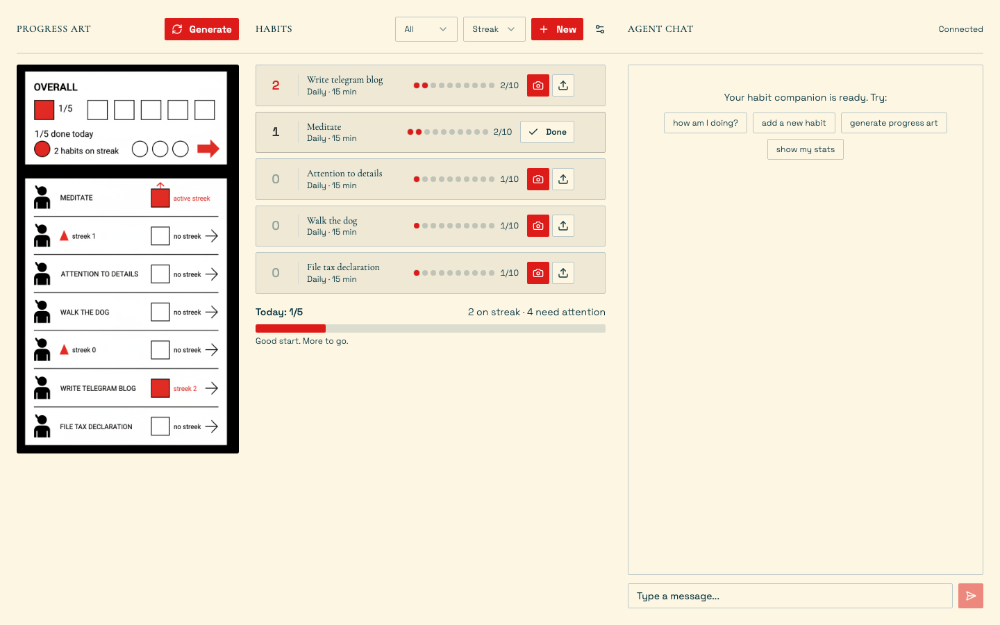

# Visual Habit Tracker

A habit tracking app with an AI companion that verifies completion via photo proof and rewards consistency with generative art.

Built with [Claude Agent SDK](https://docs.anthropic.com/en/docs/claude-agent-sdk) and Google Gemini image generation.



## How It Works

1. **Create habits** -- daily, weekly, or custom schedules
2. **Upload proof photos** -- the AI agent verifies your completion
3. **Earn streaks** -- consecutive completions build your streak
4. **Get rewarded with art** -- every completion triggers Gerd Arntz-style isotype art reflecting your progress

The AI agent acts as a friendly coach: it examines proof photos, tracks your streaks, and generates unique progress visualizations in a vintage printmaking aesthetic.

## Architecture

```
Frontend (React 19 + Vite + Tailwind v4 + shadcn/ui)
    |
    |-- REST API (habits CRUD, file uploads)
    |-- WebSocket (real-time agent chat)
    |
Backend (FastAPI)
    |
    |-- Claude Agent SDK (multi-turn chat, tool use)
    |-- Google GenAI / Gemini Flash Image (art generation)
    |-- JSON file storage (no database)
```

### Agent Tools

The Claude agent has access to these MCP tools:

- `add_habit` / `list_habits` / `complete_habit` / `delete_habit` -- habit CRUD
- `get_streak_stats` -- aggregated progress stats
- `generate_progress_art` -- creates Arntz-style isotype illustrations via Gemini
- `Read` -- examines uploaded proof images

## Tech Stack

**Backend**: Python, FastAPI, Claude Agent SDK, Google GenAI (gemini-3-pro-image-preview)

**Frontend**: React 19, TypeScript, Vite 7, Tailwind CSS v4, shadcn/ui, Lucide icons, react-markdown

**Design**: Warm cream palette, Space Grotesk + Cormorant Garamond typography, oklch colors, retro-arcade aesthetic

## Setup

### Prerequisites

- Python 3.11+
- Node.js 20+
- [Claude Code CLI](https://docs.anthropic.com/en/docs/claude-code) installed and authenticated -- the `claude` binary must be on your PATH with an active Claude Pro/Max/Team subscription
- Google AI API key (see below)

### Google API Key

The app uses Gemini for image generation. You need a **paid** Google AI account -- the free tier does not support image generation via API.

1. Go to [Google AI Studio](https://aistudio.google.com/apikey)
2. Click "Create API Key" and select a Google Cloud project (or create one)
3. Copy the key -- it looks like `AIzaSy...` (39 characters starting with `AIza`)
4. Make sure billing is enabled on the linked GCP project at [console.cloud.google.com/billing](https://console.cloud.google.com/billing)

Create a `.env` file in the **project root** (next to this README):

```
GOOGLE_API_KEY=AIzaSy...your_key_here
```

### Claude Agent SDK Auth

The Claude Agent SDK uses **subscription auth** through the Claude Code CLI. This means:

- `ANTHROPIC_API_KEY` must be **unset** in your environment (not in `.env`, not exported)
- The `claude` CLI must be logged in with an active subscription
- If you see auth errors, run `claude` in your terminal to verify it works

### Running the App

You need **two terminals** -- one for the backend, one for the frontend.

**Terminal 1 -- Backend:**

```bash
cd backend
python -m venv .venv && source .venv/bin/activate
pip install -r requirements.txt
python server.py
```

Backend runs on `http://localhost:8000`.

**Terminal 2 -- Frontend:**

```bash
cd frontend
npm install
npm run dev
```

Frontend runs on `http://localhost:5173` and proxies `/api` and `/ws` requests to the backend.

Open `http://localhost:5173` in your browser.

## Features

- Browser camera capture or file upload for proof photos
- AI agent verifies proof photos before marking habits complete
- Progress art generated in multiple art styles (Arntz, Bauhaus, Constructivist, Art Deco, Pop Art, Swiss)
- Inline habit editing (double-click to rename)
- Completion dots with proof image hover previews
- Undo completed habits
- Progress art gallery with navigation
- Real-time agent chat via WebSocket
- Configurable proof strictness, streak rules, and agent personality

## License

MIT
